# Flight Analyzer 使用说明

Flight Analyzer 是用于飞行数据导入、管理与分析的软件。当前说明文档暂包含导入、数据管理、数据分析三部分。


## 一、导入数据

导入功能用于把外部飞行数据文件导入软件数据库，并建立“机型 - 飞机 - 飞行架次”的管理层级。导入时软件会自动扫描文件夹，识别数据类型、飞行场次、飞机序号和飞行日期，并在导入前提供预览。

导入后，软件会保存解析后的数据，同时转存本次导入关联的原始文件，便于后续追溯。

### 1.0 数据目录要求

导入路径必须是一个文件夹，不能直接选择单个文件。软件会递归扫描该文件夹下的 `.txt` 数据文件。

目录中必须存在一个以 8 位日期开头的日期目录，日期格式为 `YYYYMMDD`。推荐目录结构如下：

```text
20250323_test_flight/
  Aircraft001/
    xxx_120001.txt
    xxx_120002.txt
  Aircraft002/
    xxx_130001.txt
    xxx_130002.txt
```

目录规则说明：

- 日期目录名称必须以 `YYYYMMDD` 开头，例如 `20250323`、`20250323_test_flight`。
- 飞机序号建议放在日期目录的下一层，例如 `20250323_test_flight/Aircraft001/`，此时不同飞机的架次将能够直接识别并预填。
- 数据文件可以继续放在飞机目录下的子目录中，软件会递归扫描。
- 软件会从日期目录提取默认飞行日期，并从日期目录下一层目录提取飞机序号。
- 如果目录中没有检测到日期目录，扫描会失败，需要先整理目录结构。
- **如果日期目录下没有飞机序号子目录，软件可能无法自动分配飞机，需要在导入界面手动选择或创建飞机**。

### 1.1 使用流程

1. 进入“导入数据”页面。

2. 在路径输入框中填写飞行数据文件夹路径并点击"**扫描**"，或点击"**浏览**"选择文件夹。

3. 查看扫描结果，确认目录日期、飞机序号、识别到的数据类型和场次数量。

4. 机型选择：

   * 如果匹配到已有机型，可直接使用推荐机型。

     

   * 如果发现新格式，会自动新建机型，需要输入机型名称，选择要保留的数据类型，然后点击"**创建机型并继续**"。

     > 注意，机型新建将根据当前目录中的数据文件构建，若存在当前批次数据文件均无表头的情况，则该机型的列定义部分也将缺少表头。

     
5. 对每个待导入架次确认飞机、飞行日期和飞行记录单。若架次包含FlightRecord.xml文件，会自动预填飞行记录单

   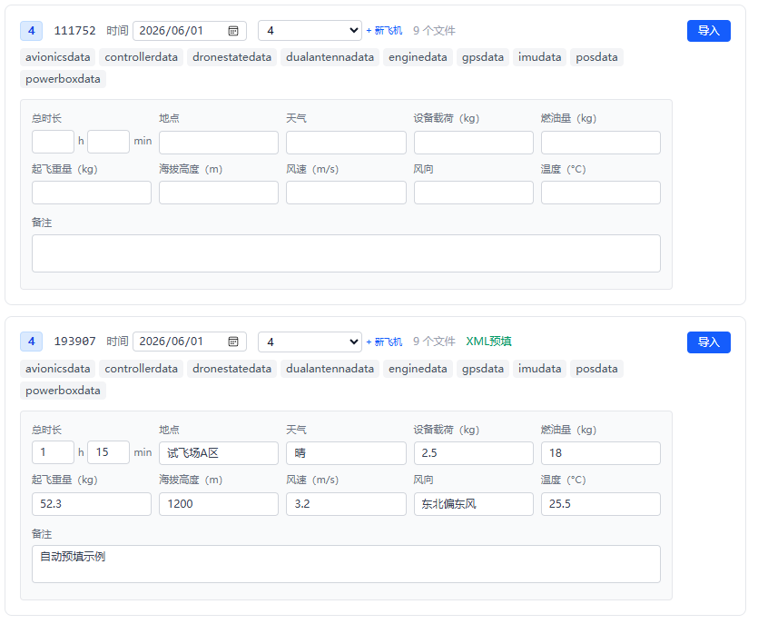

6. 点击对应场次的“**导入**”按钮，导入完整。

7. 导入完成后，可在“已导入飞行”列表中查看结果。

   


### 1.2 飞行记录单 XML 格式

推荐格式如下，数值字段可留空；字段名也可以直接使用数据库字段名，例如 `record_location`、`record_weather`。

```xml
<?xml version="1.0" encoding="UTF-8"?>
<FlightRecord>
  <BatchName>第一批</BatchName>
  <TotalDurationMin>75</TotalDurationMin>
  <Location>试飞场A区</Location>
  <Weather>晴</Weather>
  <Payload>2.5</Payload>
  <FuelAmount>18.0</FuelAmount>
  <TakeoffWeight>52.3</TakeoffWeight>
  <Altitude>1200</Altitude>
  <WindSpeed>3.2</WindSpeed>
  <WindDirection>3.2</WindDirection>
  <Note>自动预填示例</Note>
</FlightRecord>
```

字段对应关系：

- `TotalDurationMin` / `record_total_duration_min`：总时长，单位分钟。
- `Location` / `record_location`：地点。
- `Weather` / `record_weather`：天气。
- `Payload` / `record_payload`：设备载荷，按表单单位填写。
- `FuelAmount` / `record_fuel_amount`：燃油量，单位 kg。
- `TakeoffWeight` / `record_takeoff_weight`：起飞重量，单位 kg。
- `Altitude` / `record_altitude`：海拔高度，单位 m。
- `WindSpeed` / `record_wind_speed`：风速，单位 m/s。
- `WindDirection`：风向
- `Note` / `record_note`：备注。

---


## 2. 数据管理

数据管理用于维护已导入数据的组织结构、基础信息和列定义。主要管理对象包括机型、飞机、飞行架次、原始文件和数据列。

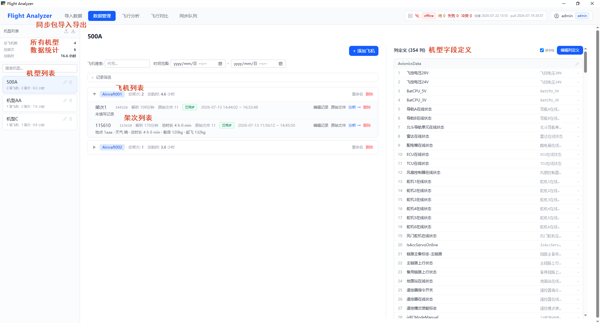

### 主要功能

- 查看全局统计信息，包括总飞机数、总架次和总航时。
- 按机型查看飞机列表和对应飞行架次。
- 添加、重命名或删除飞机。
- 重命名或删除飞行架次。
- 编辑飞行记录信息，包括地点、天气、载荷、燃油、起飞重量、海拔、风速和备注。
- 查看某个飞行架次关联的原始文件清单，并打开原始文件目录。
- 查看和编辑列定义，包括数据组名称、字段显示名称和单位。
- 导出或导入同步包（`.fapkg`）：导出时选择架次生成离线同步包，导入时先预览包内容再确认机型处理、飞机映射和重复架次策略。
- 按飞机代号、时间范围、地点、天气、载荷等条件筛选数据。


### 2.1 同步包导入导出

* 同步包导入导出位于此处，左侧为导出，右侧为导入。注意【导入】需要管理员账号登录

  

* 点击导出后，即可勾选架次，导出为xxx.fapkg

  > 注意默认导出路径为：`C:\Users\[用户名]\AppData\Roaming\FlightAnalyzer\sync_exports`

  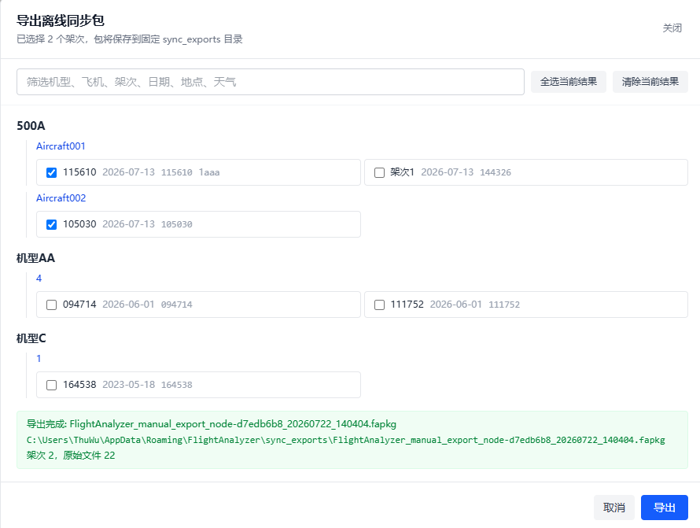

* 点击导入后，即可选择xxx.fapkg，进行导入。

  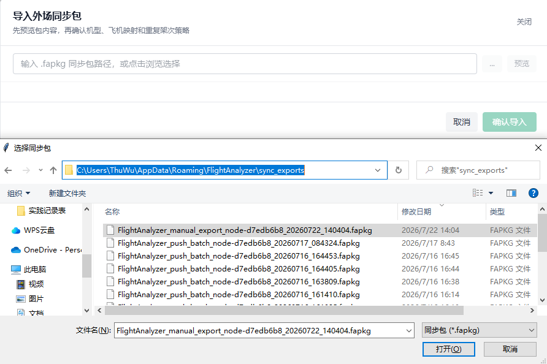


### 2.2 机型列表

* 查看总飞机数、总架次数、总航时
* 搜索机型
* 点击机型右侧的按钮可以编辑机型名称或删除机型。注意需要管理员权限才能删除


### 2.3 飞机列表&架次列表

选择机型后，即可查看该机型的飞机列表以及架次列表

* 架次筛选：通过飞机名称、架次范围、飞行记录单等内容筛选架次

  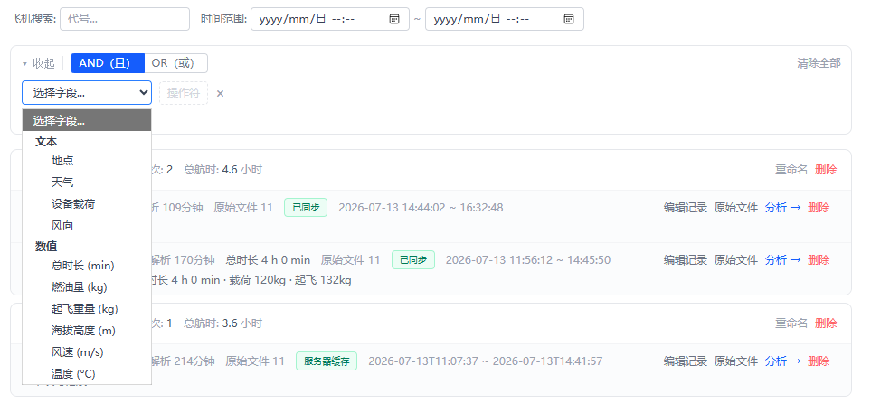

* 飞机管理：可以对飞机进行重命名和删除。删除需要管理员权限

* 架次管理

  * 点击架次右边的**🖊**可以编辑架次名称
  * 点击**编辑记录**，可以修改飞行记录单
  * 点击**原始文件**，将打开转存的原始数据文件
  * 点击**分析→**，则跳转至该架次的飞行分析tab页
  * 点击**删除**，则将删除该架次。删除需要管理员权限

  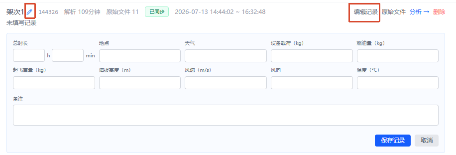


### 2.4 列定义*

不同的机型的数据列不统一，无法预先处理，且部分旧数据文件缺失表头，因此统一在软件中维护。

* **组名称**默认为数据文件的文件名；**原字段**为数据文件中的表头。

  * 若有表头，则**原字段**和**字段名称**均为表头
  * 若缺失表头，则**原字段**为`col_n`，**字段名称**为`列n`

  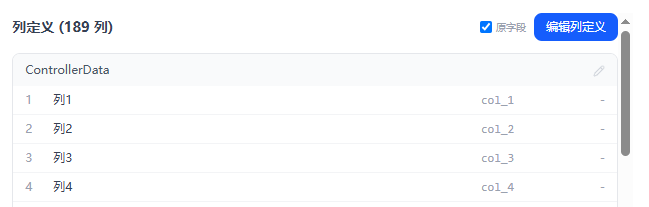

* 数据组名称编辑：点击右侧**🖊**即可编辑修改数据组名称，对应【飞行分析】中的数据项组名。

  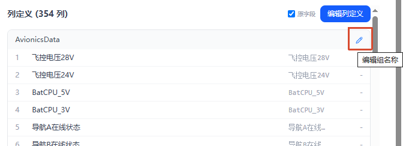

  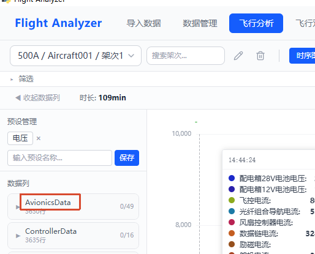

* 点击**编辑列定义**，即可以修改字段的名称和单位。注意，编辑列定义需要管理员权限。

  >  注意，【飞行分析】的图表中，同一单位的数据项共用一个Y轴（所有未配置单位的数据项也共用一个Y轴）。
  >
  > 具体见3.3的Y轴部分。

  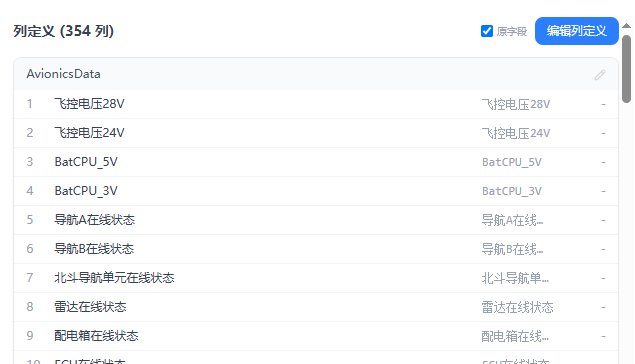

  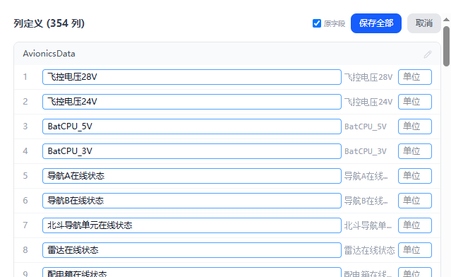


## 三、飞行分析

### 主要功能

* 架次选择
* 数据列选择
* 图表查看
* 筛选栏

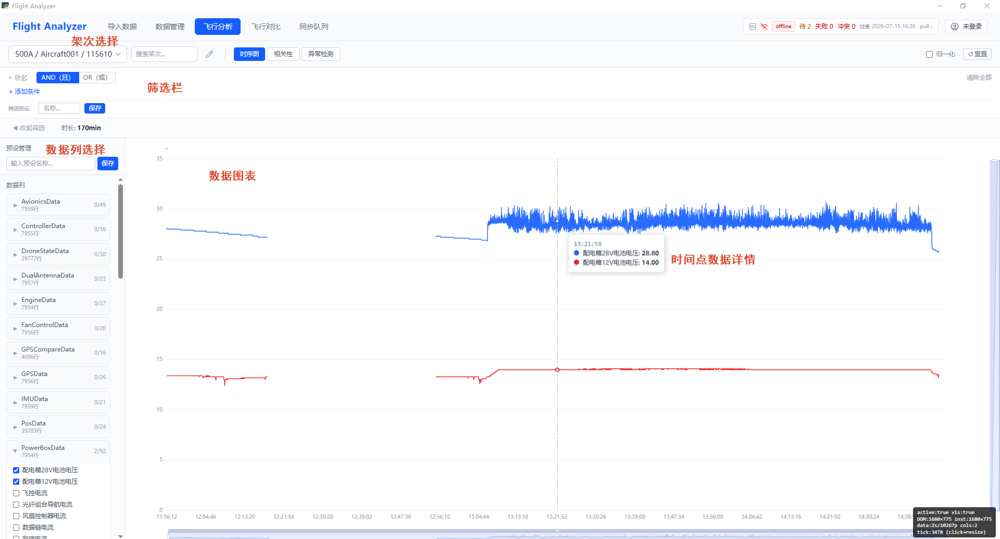


### 3.1 架次选择

通过树状选择框来选择需要分析的飞行架次，支持按架次名搜索


### 3.2 数据列选择

* 勾选需要查看的数据项

  

* 点击数据类别名称，可以全选该类型的数据项；再次点击即可取消全选

  

* 通过输入预设名称，可以将当前勾选的数据项进行保存。


* 点击之前保存的预设，将自动选中该预设所选的数据项

  

* **数据列缩放**：数据项右侧可以填写缩放系数，便于直观比较差异较大的数据项。

  

  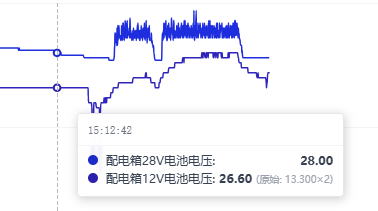


### 3.3 图表

* 选择数据项后，即可看在图表中看到相应的曲线。

* 对于文字类型的值，无相应曲线，但是可以在悬浮框中看到对应的值
* 缩放：
  * 双击局部放大
  * 【滚轮】缩放X轴；【Ctrl+滚轮】缩放Y轴
  * 点击右上角【重置】，可以重置缩放
* 归一化：将所有值归一化至**0-1**，便于观察变化情况
* Y轴：同一单位的数据项共用一个Y轴（所有未配置单位的数据项也共用一个Y轴）。配置见【2.4】

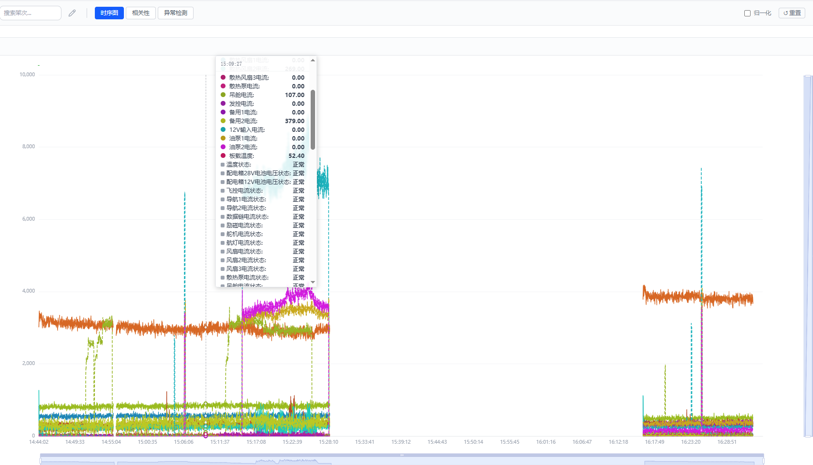


### 3.4 筛选栏

1. 打开筛选栏，点击添加条件

   

   

2. 点击下拉框，将出现【3.2】中选择好的数据项，并填写需要筛选的条件。支持选择多个筛选条件，并设定筛选条件之间的逻辑关系。

   

3. 筛选后，满足条件的X轴会附带蓝色背景。

   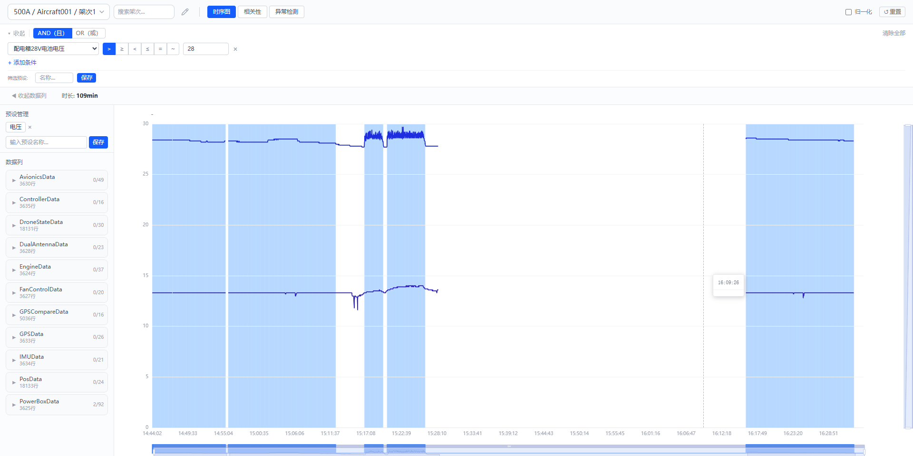


## 四、同步队列

同步队列主要用于将数据从**科研网客户端**同步至**科研网统一数据库**

注意，【2.1同步包导入导出】的主要作用为将**外场客户端**中的架次数据导入到**科研网客户端**。


1. 连接科研网服务器，并登录管理员账号，即可进行同步操作

   

2. **只上传**为将客户端内容上传至服务器；**从服务器拉取到本地**为将服务器内容拉取到本地；**同步一次**即为先上传当前客户端内容，再从服务器拉取内容到本地。

   点击同步后，可以看到同步预览，查看当前待上传和待下载的内容。

   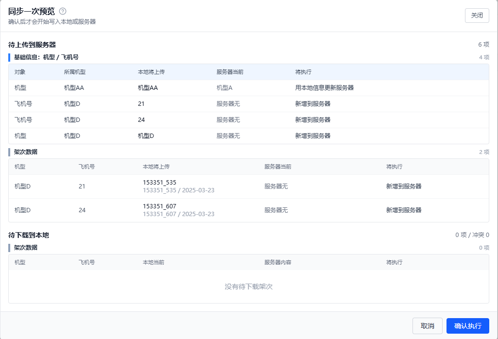

3. 单独上传：下方列表会显示本地架次信息，可以单独选择并进行上传。

   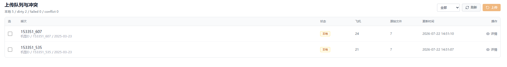


## 五、用户管理

连接科研网服务器并登录管理员账号，即可看到用户管理tab页。进入后可以管理账号。

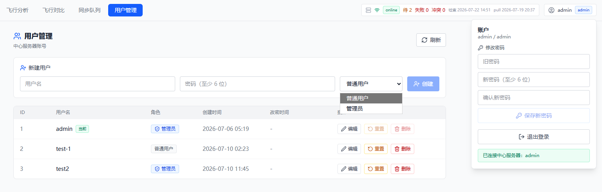

